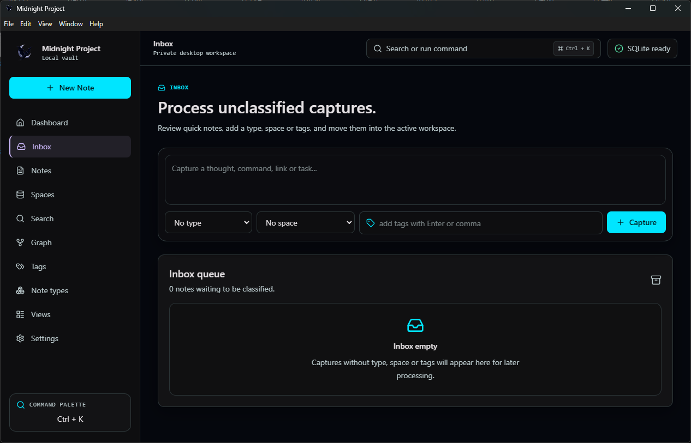
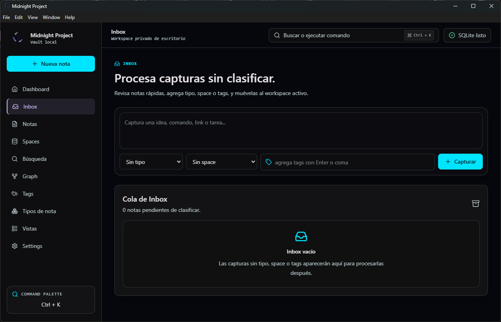

 

 
 

---

# Said Pereyra

**ES**
Desarrollador de software de México enfocado en sistemas web y móviles, herramientas local-first, MVPs SaaS y flujos de desarrollo asistidos por IA.

Construyo software práctico con Laravel, React, React Native, TypeScript, Electron, bases de datos SQL y APIs.

**EN**
Software Developer from México focused on web and mobile systems, local-first tools, SaaS MVPs and AI-assisted development workflows.

I build practical software with Laravel, React, React Native, TypeScript, Electron, SQL databases and APIs.

## Enfoque actual / Current focus

* Midnight Project — workspace desktop modular local-first
* Archimedes Core — CLI académica local-first / local-first academic CLI
* DevBuddy — herramientas de productividad developer / developer productivity tooling
* SaaS / Mobile / Laravel systems

## Stack técnico / Tech stack

 

Laravel · React · React Native · Expo · TypeScript · Electron · SQLite · MySQL · PostgreSQL / Supabase · REST APIs · Python / OCR · GitHub

## Trabajo destacado / Featured work

* [Portafolio personal / Personal portfolio](https://saidpereyra.github.io)
* Midnight Project
* Archimedes Core
* DevBuddy
* [Code Nebula](https://code-nebula-three.vercel.app)

 

  

## Midnight Project Preview

<strong>English UI</strong>

 
 

<strong>Interfaz en español</strong>

## Qué estoy construyendo / What I’m building

**ES**
Actualmente estoy explorando software local-first, herramientas developer, flujos académicos y desarrollo práctico asistido por IA para productos web y móviles del mundo real.

**EN**
I’m currently exploring local-first software, developer tooling, academic workflows and practical AI-assisted development for real-world web and mobile products.

---

<a href="https://saidpereyra.github.io">
  <strong>Portfolio</strong>
</a>
&nbsp;·&nbsp;
<a href="https://github.com/SaidPereyra">
  <strong>GitHub</strong>
</a>
&nbsp;·&nbsp;
<a href="https://www.linkedin.com/in/waldir-said-pereyra-orozco/">
  <strong>LinkedIn</strong>
</a>

